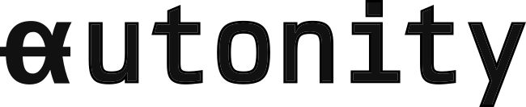

<div align="center">
  
  <br/>
  <b>Main client software for Autonity networks</b>
</div>

---

[](https://codecov.io/gh/autonity/autonity)
[](https://goreportcard.com/report/github.com/autonity/autonity)
[](https://github.com/autonity/autonity/blob/master/COPYING)
[](https://github.com/autonity/autonity/blob/master/COPYING.LESSER)
[](https://github.com/autonity/autonity/issues)
[](https://github.com/autonity/autonity/autonity)
[](https://github.com/autonity/autonity/stargazers)

---

<div align="center">
    <p>Documentation @ <a href="https://docs.autonity.org">https://docs.autonity.org</a></p>
</div>

### What is Autonity?

Autonity is an EVM-based Layer 1 blockchain protocol for peer-to-peer networks hosting decentralised risk markets. Autonity networks are permissionless: access is open to all and anyone can operate a network node.

Autonity networks are Byzantine fault-tolerant and secured by delegated Proof of Stake using Tendermint consensus. Autonity has native protocol coins and implements a liquid staking model. Native coins are the *Auton*  utility coin used in the transaction fee mechanism and *Newton* for staking the network. *Liquid Newton* is minted and burned as stake is bonded and redeemed.

Key features of the Autonity Protocol are: 

- immediate and deterministic transaction finality in a public environment where participant nodes can join the network dynamically without permission
- delegated Proof of Stake consensus for committee selection and blockchain management, using the deterministic Tendermint BFT consensus algorithm
- dual coin tokenomics, with native coins _Auton_ and _Newton_ for utility and staking
- liquid staking for capital efficiency, staked newton yielding transferrable _Liquid Newton_ redeemed for _Newton_ on unbonding stake
- epoch-based staking reward distribution

Core technology is the Autonity Go Client (AGC). AGC is the reference implementation of the Autonity Protocol and provides the main client software run by participant peer nodes in an Autonity network system. The client is a fork of [Go Ethereum](https://github.com/ethereum/go-ethereum).

For more information about Autonity networks and risk markets visit the Project website @ <a href="http://autonity.org">http://autonity.org</a>.

## Installation

The minimum recommended device specifications for an Autonity node are:

| Requirement | Minimum | Recommended |
|-------------|---------|-------------|
| OS | Ubuntu 20.04	LTS | Ubuntu 20.04 LTS |
| CPU | 3.10 GHz with 8 CPU's | 3.10 GHz with 16 CPU's |
| RAM | 8GB | 16GB |
| Storage | 1024GB free storage for full nodes and Validators | 1024 GB free storage for full nodes and validators |
| Network interface	| 200 Mbit/s | 200 Mbit/s |

### Linux Binaries

Download pre-built binaries of the Autonity client and NodeJS Console CLI for Linux from the [Release Archive](https://github.com/autonity/autonity/releases).

### Build from source

#### Prerequisites

To build you will need :

* Go (version 1.15 or later) - https://golang.org/dl
* A C compiler - for example, [GCC](https://gcc.gnu.org/)
* Docker Engine [Server](https://docs.docker.com/engine/install/#server)
* [GNU Make](https://www.gnu.org/software/make/) utility to generate the executable from source files

To install and run the Autonity NodeJS Console you will need [nodejs](https://nodejs.org/en/download/) and [npm](https://docs.npmjs.com/downloading-and-installing-node-js-and-npm).

#### Get the source code

Clone the Autonity Go Client repository:

```
git clone git@github.com:autonity/autonity.git
cd autonity
```

#### Build

To build the Autonity Go Client (AGC) run:

```
make autonity
```

This generates the Autonity binary in the `/build/bin/` directory. Run `./build/bin/autonity` to start the client, `CTRL+C` to stop. To view the client's command-line options run `autonity --help`. 

To build the Autonity Go Client (AGC) and Tools in the `cmd` subdirectory, run:

```
make all
```

To build the Docker image run:

```
make build-docker-image
```

This generates the Autonity Go Client Docker image and manifest.

## Run a node

Quick-start connecting to an Autonity testnet by using a testnet flag in the command line to set the genesis config for that network when starting the client. For example, to connect to the Piccadilly Testnet:

```
./build/bin/autonity --piccadilly
```

For full docs on how to run the client and connect to a public Autonity network see [Networks](https://docs.autonity.org/networks/) and [Run Autonity](https://docs.autonity.org/node-operators/run-aut/).

## Connect to a node using Autonity Utility Tool `aut`

The recommended way of interacting with an Autonity node is via `aut`, which provides a command-line interface to Autonity-specific queries and operations, as well as much of the base Ethereum functionality.

For source code, installation, and usage see the [aut repository](https://github.com/autonity/aut).

See the docs how to [Setup the Autonity Utility Tool (aut)](https://docs.autonity.org/account-holders/setup-aut/) for how to make calls and submit transactions.

## Networks

### Testnets

For details of how to connect your node to a public Autonity network see [docs.autonity.org/networks](https://docs.autonity.org/networks).

## License

The go-ethereum library (i.e. all code outside of the `cmd` directory) is licensed under the [GNU Lesser General Public License v3.0](https://www.gnu.org/licenses/lgpl-3.0.en.html), also included in the repository in the `COPYING.LESSER` file.

The go-ethereum binaries (i.e. all code inside of the `cmd` directory) is licensed under the [GNU General Public License v3.0](https://www.gnu.org/licenses/gpl-3.0.en.html), also included in the repository in the `COPYING` file.
