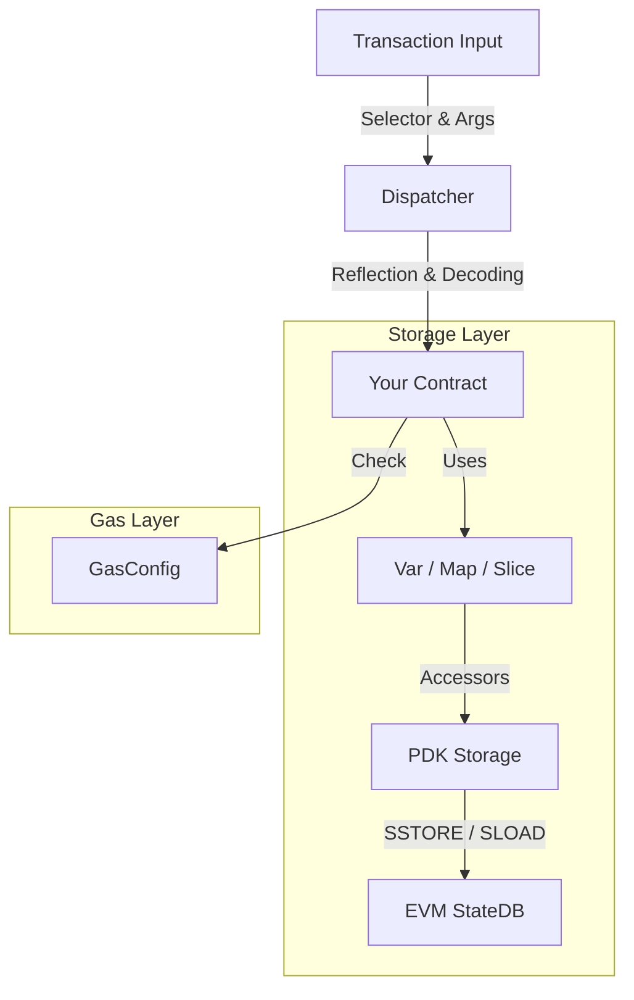

# Architecture Guide

The Autonity PDK is designed to abstract away the low-level details of EVM execution (stack manipulation, memory offsets, storage slots) and provide a Go-native development experience.



## 1. The Dispatcher (`dispatcher/`)

The Dispatcher is the entry point for your contract. It replaces the traditional Solidity ABI decoder.

*   **Role:**
    *   Parses the input byte array (`calldata`).
    *   Matches the 4-byte function selector to a Go method.
    *   Decodes ABI arguments into Go types (e.g., `uint256` -> `*big.Int` or `storage.Uint256`).
    *   Invokes the method using Go reflection.
    *   Encodes return values back to ABI format.
*   **Performance:** Uses runtime reflection. For extremely hot paths, code generation (future) is preferred, but reflection provides the best developer experience.

## 2. The Storage Layer (`storage/`)

Instead of manually calculating `keccak256(key + slot)`, the PDK uses a type-safe wrapper system.

*   **Binders:** When a contract runs, the PDK "binds" your Go struct fields to specific storage slots.
*   **Accessors:** Each type (uint64, address, bytes) has an `Accessor` that knows how to read/write its bits to a 32-byte EVM slot.
*   **StateDB:** The PDK wraps the underlying `vm.StateDB` to handle caching and dirty tracking.

## 3. Gas Metering (`gas/`)

Precompiles do not have intrinsic gas costs for their opcodes (unlike Solidity bytecode). You must define a `GasConfig`.

*   **Base Cost:** A flat fee for calling the method.
*   **Dynamic Calculator:** A function `func(input []byte) uint64` to charge based on input length (e.g., O(n) for hashing).

```go
config := gas.NewConfig(5000)
config.SetMethodGas("MyLoop", gas.MethodGas{
    Base: 1000, 
    Calculator: gas.ArrayLengthCalculator(100), // +100 gas per item
})
```
